<table>
<tr>
<Table>
  <tr>
    <td>
      
    </td>
  </tr>
</table>

# 🎫 Fichas de Tarefas 🎟️

## Integrantes:

- <a href="https://www.linkedin.com/in/bruna-brasil-alexandre/">Bruna Brasil ✨</a>

## Sumário

- [1. Introdução](#introducao)
- [2. Objetivos ](#objetivos)
- [3. Propósitos dos commits](#proposito-commits)
- [4. Materiais ](#materiais)
- [5. Método ](#metodo)
- [6. Resultados](#resultado)
- [7. Conclusão](#conclusao)
- [8. Referências](#referencias)

## 1. Introdução

Bem-vindo ao projeto que visa explorar uma abordagem criativa e desafiadora para o desenvolvimento de uma aplicação web interativa. Neste contexto, nossa jornada se concentra em criar uma página web com funcionalidades aparentemente simples - adicionar e remover fichas - mas com um toque intrigante: o comportamento dessas operações é manipulado de forma a garantir que o número de fichas apenas aumente.

## 2. Ideia

A ideia central por trás deste projeto é oferecer uma experiência única aos usuários ao desafiar suas expectativas e percepções comuns sobre interações básicas em uma página web. Ao apresentar botões aparentemente convencionais para adicionar, remover e reiniciar fichas, pretendemos criar uma dinâmica envolvente onde o número de fichas continua a aumentar independentemente das ações realizadas pelo usuário.

Essa abordagem não apenas demonstra conceitos avançados de manipulação de interface e comportamento de usuário, mas também convida os participantes a refletir sobre a natureza da interatividade digital e explorar novas perspectivas sobre o que é possível em termos de experiência do usuário na web.

Ao longo deste projeto, mergulharemos na implementação detalhada dessa ideia, explorando técnicas de programação e design web para criar uma aplicação que seja não apenas funcional, mas também cativante e surpreendente para quem a utiliza.

## 3. Propósitos dos commits

### Main
####

1. **Initial commit**
   - **Propósito:** Este commit marca o início do projeto. Inclui a configuração inicial do repositório e um arquivo readme.md básico para começar o desenvolvimento.

2. **Criação de arquivos separados para cada linguagem de programação**
   - **Propósito:** Organização dos arquivos por linguagem de programação, facilitando a manutenção e entendimento do código. Os arquivos HTML, CSS e JavaScript foram separados em arquivos individuais.

3. **Adiciona a lógica para o funcionamento da página**
   - **Propósito:** Este commit adiciona a lógica para o funcionamento da página. Inclui funcionalidades dos botões para modificar o valor da quantidade de fichas e alterar a cor do fundo do site.

4. **Adiciona a página inicial que o usuário visualiza na web**
   - **Propósito:** Esta alteração adiciona o HTML para criar a página inicial que o usuário visualiza ao acessar o site. Inclui o título, botões e a visualização dinâmica da quantidade de fichas.

5. **Adicionar configurações de estilo**
   - **Propósito:** Este commit adiciona configurações de estilo ao projeto, como tamanhos, cores e posicionamentos. Essas configurações serão aplicadas ao HTML para estilizar a página web.

5. **Adicionar um arquivo descritivo readme.md**
   - **Propósito:** Este commit um arquivo readme com descrição do projeto, propósitos dos commits e referências.

7. **Merge pull request #1 from bruuna-brasil/feature/js**
   - **Propósito:** Fusão de um pull request que incluiu mudanças no JavaScript relacionadas a funcionalidades específicas, como a lógica para o funcionamento da página.

8. **Merge pull request #2 from bruuna-brasil/feature/html**
   - **Propósito:** Fusão de um pull request que incluiu mudanças no HTML relacionadas à criação da página inicial da aplicação.

9. **Merge pull request #3 from bruuna-brasil/feature/css**
   - **Propósito:** Fusão de um pull request que incluiu mudanças no CSS relacionadas à adição de configurações de estilo ao projeto.

10. **Merge pull request #4 from bruuna-brasil/feature/readme**
   - **Propósito:** Fusão de um pull request que incluiu mudanças no readme relacionadas à adição de um arquivo descritivo.

11. **Atualização do redme na branch errada**
   - **Propósito:** Esta atualização foi feita no arquivo `readme.md`, mas na branch incorreta, o que foi proposital para demonstração.

12. **Adicionar um arquivo descritivo readme.md**
   - **Propósito:** Este commit adiciona um arquivo `readme.md` ao projeto.

13. **Merge branch 'develop' into feature/readme**
   - **Propósito:** Fusão de alterações da branch de desenvolvimento para a branch `feature/readme`, adicionando as mudanças no readme na develop.

14. **Merge pull request #4 from bruuna-brasil/feature/readme**
   - **Propósito:** Fusão de um pull request que incluiu mudanças relacionadas à adição do arquivo `readme.md`.

15. **Criação de conflito proposital**
   - **Propósito:** Este commit foi feito intencionalmente para criar um conflito durante o processo de fusão de branches. Feito para testar a resolução de conflitos e para demonstrar como lidar com eles.

16. **Merge branch 'main' into develop**
   - **Propósito:** Fusão de alterações da branch principal (`main`) para a branch de desenvolvimento (`develop`), integrando possíveis correções e atualizações antes de prosseguir com o desenvolvimento.

17. **Merge pull request #5 from bruuna-brasil/develop**
   - **Propósito:** Fusão de um pull request que incluiu mudanças relacionadas à branch de desenvolvimento (`develop`).

### Develop
####

1. **Initial commit**
   - **Propósito:** Este commit marca o início do projeto. Inclui a configuração inicial do repositório e um arquivo readme.md básico para começar o desenvolvimento.

2. **Criação de arquivos separados para cada linguagem de programação**
   - **Propósito:** Organização dos arquivos por linguagem de programação, facilitando a manutenção e entendimento do código. Os arquivos HTML, CSS e JavaScript foram separados em arquivos individuais.

3. **Adiciona a lógica para o funcionamento da página**
   - **Propósito:** Este commit adiciona a lógica para o funcionamento da página. Inclui funcionalidades dos botões para modificar o valor da quantidade de fichas e alterar a cor do fundo do site.

4. **Adiciona a página inicial que o usuário visualiza na web**
   - **Propósito:** Esta alteração adiciona o HTML para criar a página inicial que o usuário visualiza ao acessar o site. Inclui o título, botões e a visualização dinâmica da quantidade de fichas.

5. **Adicionar configurações de estilo**
   - **Propósito:** Este commit adiciona configurações de estilo ao projeto, como tamanhos, cores e posicionamentos. Essas configurações serão aplicadas ao HTML para estilizar a página web.

5. **Adicionar um arquivo descritivo readme.md**
   - **Propósito:** Adição do readme com descrição do projeto, propósitos dos commits e referências.

7. **Merge pull request #1 from bruuna-brasil/feature/js**
   - **Propósito:** Fusão de um pull request que incluiu mudanças no JavaScript relacionadas a funcionalidades específicas, como a lógica para o funcionamento da página.

8. **Merge pull request #2 from bruuna-brasil/feature/html**
   - **Propósito:** Fusão de um pull request que incluiu mudanças no HTML relacionadas à criação da página inicial da aplicação.

9. **Merge pull request #3 from bruuna-brasil/feature/css**
   - **Propósito:** Fusão de um pull request que incluiu mudanças no CSS relacionadas à adição de configurações de estilo ao projeto.

10. **Merge pull request #4 from bruuna-brasil/feature/readme**
   - **Propósito:** Fusão de um pull request que incluiu mudanças no readme relacionadas à adição de um arquivo descritivo.

### Feature/readme

1. **Adicionar um arquivo descritivo readme.md**
    - **Propósito**: Adição do readme com descrição do projeto, propósitos dos commits e referências.

### Feature/html

####

1. **Adiciona a página inicial que o usuário visualiza na web**
   - **Propósito:** Esta alteração adiciona o HTML para criar a página inicial que o usuário visualiza ao acessar o site. Inclui o título, botões e a visualização dinâmica da quantidade de fichas.

### Feature/css

####

1. **Adicionar configurações de estilo**
   - **Propósito:** Este commit adiciona configurações de estilo ao projeto, como tamanhos, cores e posicionamentos. Essas configurações serão aplicadas ao HTML para estilizar a página web.

### Feature/js

####

1. **Adiciona a lógica para o funcionamento da página**
   - **Propósito:** Este commit adiciona a lógica para o funcionamento da página. Inclui funcionalidades dos botões para modificar o valor da quantidade de fichas e alterar a cor do fundo do site.

## 4. Materiais

Claro, aqui está um exemplo do texto para a seção de Materiais:

## 4. Materiais

Durante a realização deste projeto, foram utilizados os seguintes materiais e recursos:

- **Computador:** Um computador pessoal com sistema operacional compatível para acesso ao console da AWS e execução de comandos.
- **Nuvem AWS (Amazon Web Services):** Utilizamos a infraestrutura de computação em nuvem da AWS para provisionar e gerenciar instâncias EC2.
- **Imagens ISO do Ubuntu:** Para instalar o sistema operacional Ubuntu nas instâncias EC2.
- **Chave SSH:** Foi criada uma chave SSH para autenticação segura durante o acesso às instâncias EC2.
- **Cliente SSH:** Utilizamos um cliente SSH para acessar remotamente as instâncias EC2.
- **GitHub:** Repositório remoto no GitHub, onde o código-fonte da aplicação/API estava armazenado e versionado.
- **Software de Gerenciamento de Processos (PM2):** Utilizado para gerenciar e monitorar a execução da aplicação/API no servidor.
- **Outros recursos de software:** npm (Node Package Manager) e Node.js para instalação de dependências e execução da aplicação/API.

Esses materiais foram essenciais para a criação, configuração e execução bem-sucedida da instância EC2 na AWS, bem como para o desenvolvimento e implantação da aplicação/API.

## 5. Método

Para realizar o levantamento da API, foram necessários diversos passos. Abaixo, detalhamos cada etapa do processo:

### 1. Criar Instância EC2 na AWS

Ao acessar o console da AWS, selecionamos a opção "Criar Máquina Virtual com EC2". Isso nos levou à tela inicial do processo de criação da instância.

 Figura 1: Criar Instância EC2 

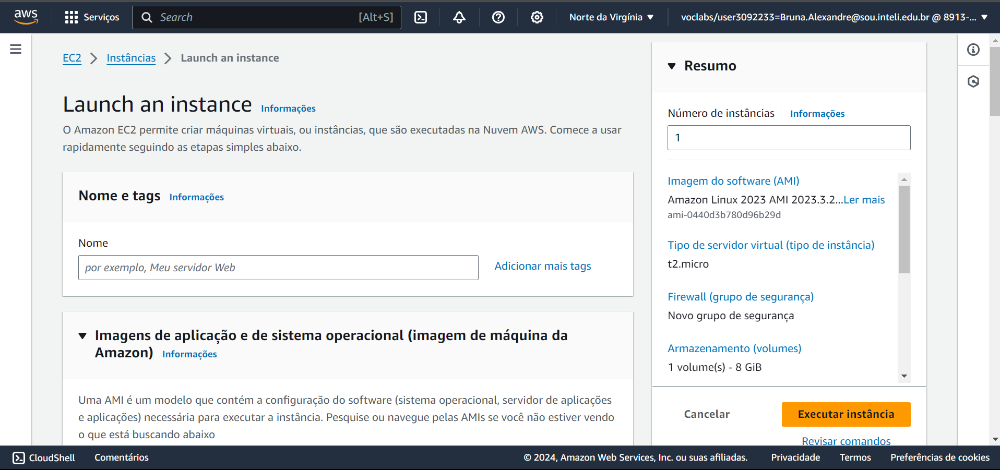

 Elaboração Bruna Brasil 

### 2. Nomear a Instância

Após selecionar a opção "Criar Máquina Virtual com EC2", foi solicitado que nomeássemos a instância. Optamos por nomeá-la como "Minha ponderada semana 03".

 Figura 2: Nomear a Instância 

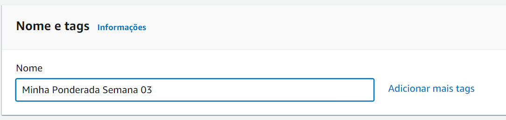

 Elaboração Bruna Brasil 

### 3. Selecionar o Sistema Operacional

Escolhemos o sistema operacional Ubuntu devido à sua versatilidade e facilidade de uso.

 Figura 3: Selecionar o Sistema Operacional 

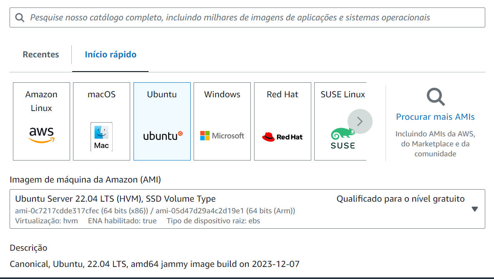

 Elaboração Bruna Brasil 

### 4. Criar Chave SSH

Foi necessário criar uma chave privada SSH para garantir a segurança do acesso ao projeto.

 Figura 4: Criar Chave SSH 

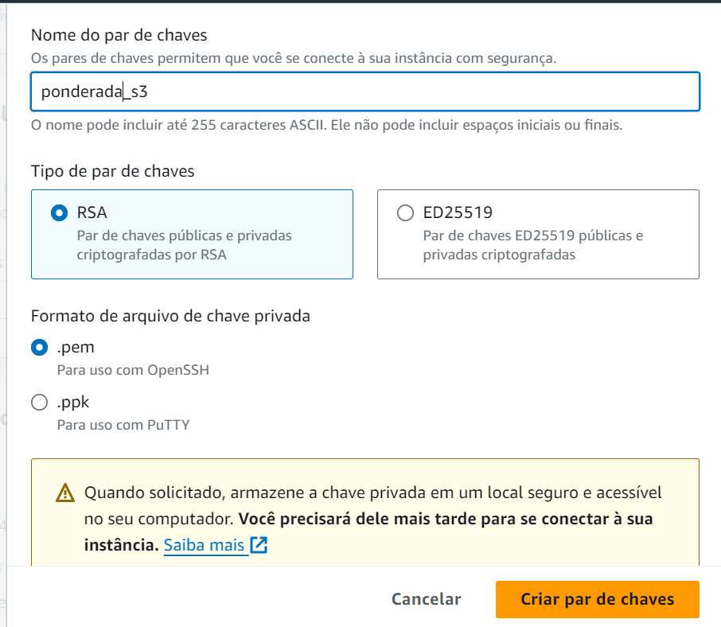

 Elaboração Bruna Brasil 

### 5. Criar Grupo de Segurança

Selecionamos as permissões para SSH, HTTPS e HTTP para permitir o acesso por esses meios.

 Figura 5: Criar Grupo de Segurança 

 Elaboração Bruna Brasil 

### 6. Tela de Carregamento da Instância

Após clicar em "Executar Instância", foi exibida uma tela de carregamento enquanto a instância era inicializada.

 Figura 6: Tela de Carregamento da Instância 

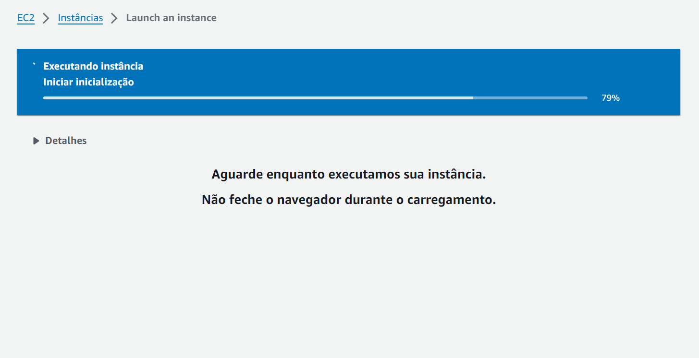

 Elaboração Bruna Brasil 

### 7. Instância Criada com Sucesso

A instância foi criada com sucesso e estava pronta para ser utilizada.

 Figura 7: Instância Criada com Sucesso 

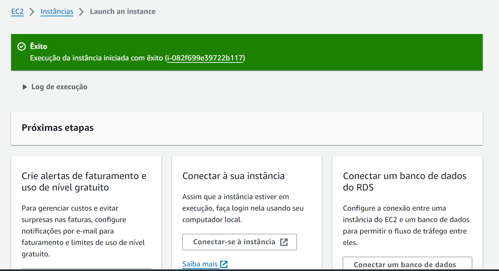

 Elaboração Bruna Brasil 

### 8. Detalhes da Instância

Visualizamos os detalhes da instância, incluindo seu ID, endereço IP público e privado.

 Figura 8: Detalhes da Instância 

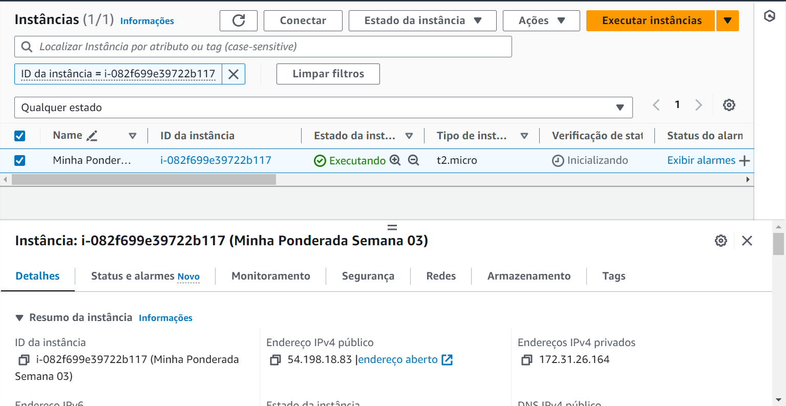

 Elaboração Bruna Brasil 

### 9. Acesso ao Servidor via Terminal

Utilizamos o cliente SSH para acessar localmente nossa instância.

 Figura 9: Acesso ao Servidor via Terminal 

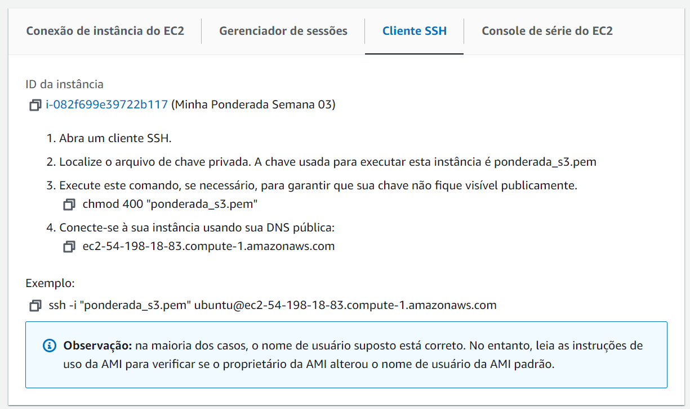

 Elaboração Bruna Brasil 

### 10. Confirmação de Entrada no Servidor

Confirmamos a entrada no servidor via terminal, onde pudemos iniciar o uso do sistema operacional da máquina virtual para outras finalidades, como conectar-se ao repositório do GitHub e construir nossa API.

 Figura 10: Confirmação de Entrada no Servidor 

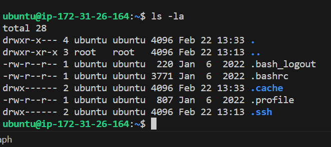

 Elaboração Bruna Brasil 

Dessa maneira, concluímos o processo de criação e configuração da instância EC2 na AWS para o desenvolvimento da nossa aplicação. Logo, a máquina virtual já está sendo acessada localmente.

### 11. Configurar Segurança da Chave SSH

Após a criação da instância EC2, foi necessário configurar a segurança da chave SSH para garantir acesso seguro à instância. Isso incluiu desabilitar a herança e aplicar as permissões adequadas à chave SSH.

 Figura 12: Configurar Segurança da Chave SSHl 

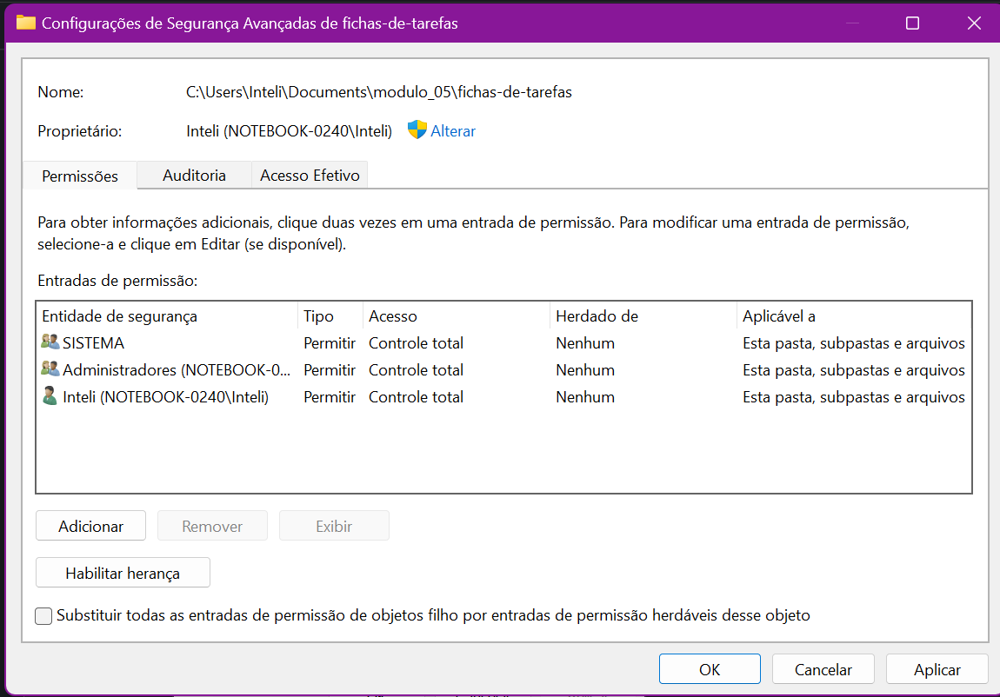

 Elaboração Bruna Brasil 

### 12. Atualizar Instância EC2

Após configurar a segurança da chave SSH, procedemos com a atualização da instância EC2 para garantir que todos os pacotes e softwares estivessem atualizados.

 Figura 13: Atualizar Instância EC2 

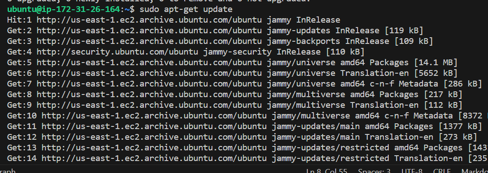

 Elaboração Bruna Brasil 

### 13. Instalar npm (Node Package Manager)

Um passo crucial foi a instalação do npm para gerenciar as dependências do projeto e facilitar o desenvolvimento da aplicação/API.

 Figura 14: Instalar npm 

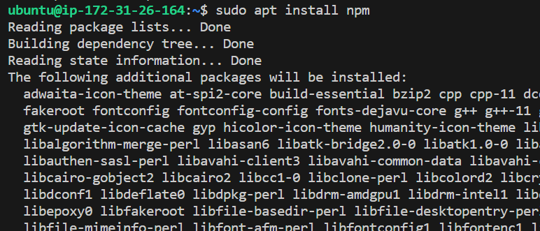

 Elaboração Bruna Brasil 

### 14. Instalar Node.js

Além do npm, também instalamos o Node.js, que é uma plataforma de execução de código JavaScript que permite executar aplicações do lado do servidor.

 Figura 15: Instalar Node.js 

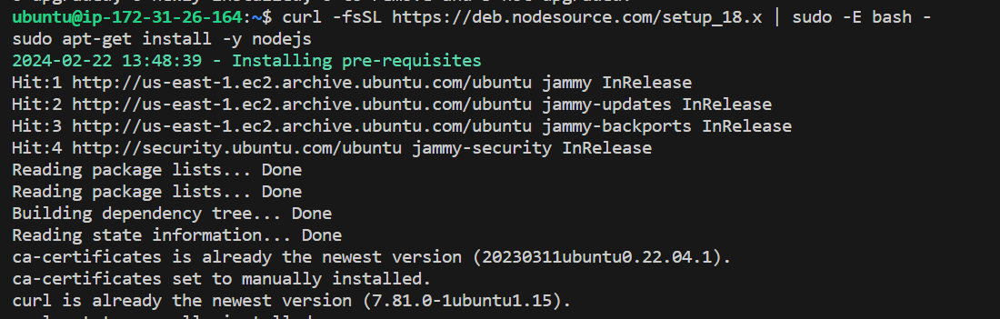

 Elaboração Bruna Brasil 

Esses passos foram essenciais para preparar o ambiente de desenvolvimento e configurar a instância EC2 para execução da aplicação/API. Com essas etapas concluídas, estávamos prontos para prosseguir com o desenvolvimento e implantação da nossa aplicação.

## 6. Resultados🥇

Após concluir a configuração da instância EC2 e preparar o ambiente de desenvolvimento, procedemos com o clonagem do repositório do GitHub contendo o código-fonte da nossa aplicação/API. Em seguida, instalamos as dependências do projeto e utilizamos a biblioteca PM2 para realizar o deploy da API. Abaixo, detalhamos cada etapa do processo de implementação:

 Figura 13: Clonagem do Repositório no GitHub 

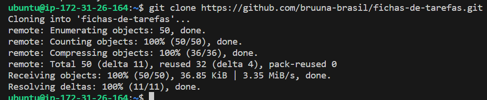

 Elaboração Bruna Brasil 

Após configurar a instância e preparar o ambiente, procedemos com a clonagem do repositório contendo o código-fonte da aplicação/API do GitHub. Isso nos permitiu ter acesso ao código atualizado e pronto para implantação.

 Figura 14: Instalação das Dependências do Projeto 

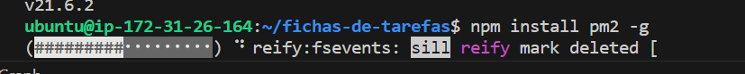

 Elaboração Bruna Brasil 

Em seguida, acessamos a pasta do projeto e instalamos todas as dependências necessárias para o correto funcionamento da aplicação/API. Isso incluiu bibliotecas, frameworks e outros pacotes necessários para o desenvolvimento e execução do projeto.

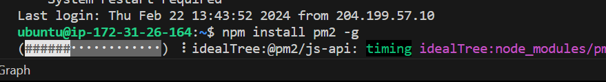

 Figura 15: Utilização do PM2 para Deploy da API 

 Elaboração Bruna Brasil 

Utilizamos a biblioteca PM2 para realizar o deploy da API, garantindo um processo de implantação simplificado e eficiente. Configuramos o PM2 para iniciar o arquivo principal da aplicação/API e monitoramos o seu funcionamento.

 Figura 16: Inicialização da Aplicação/API com PM2 

 Elaboração Bruna Brasil 

Por fim, iniciamos a aplicação/API utilizando o PM2 e verificamos que ela estava ativa e funcionando corretamente. Isso foi confirmado pela mensagem de sucesso exibida pelo PM2 após a inicialização da aplicação/API.

Essas etapas foram cruciais para a implementação bem-sucedida da nossa aplicação/API na instância EC2 da AWS. Com isso, nossa aplicação estava pronta para ser acessada e utilizada conforme necessário.

## 7. Conclusão

Em conclusão, a realização deste projeto representou um passo significativo no desenvolvimento e implantação de uma aplicação/API na nuvem utilizando a AWS (Amazon Web Services). Através do processo detalhado de criação e configuração de uma instância EC2, bem como da preparação do ambiente de desenvolvimento e implantação da nossa aplicação, pudemos adquirir conhecimentos valiosos sobre a infraestrutura em nuvem e suas aplicações práticas.

Durante o desenvolvimento, enfrentamos desafios e aprendemos a superá-los, desde a configuração inicial da instância até a realização do deploy da API utilizando ferramentas como o PM2. Cada etapa nos proporcionou uma compreensão mais profunda dos conceitos fundamentais de computação em nuvem, segurança da informação e gerenciamento de servidores.

Além disso, a aplicação pronta para uso representa não apenas um marco em nosso projeto, mas também uma base sólida para futuros desenvolvimentos e expansões. A capacidade de acessar e gerenciar nossa aplicação remotamente oferece flexibilidade e escalabilidade para atender às demandas em constante evolução do mercado.

Em suma, este projeto não apenas nos permitiu aplicar habilidades técnicas adquiridas, mas também nos capacitou com um entendimento mais amplo e prático das tecnologias em nuvem e seu potencial para impulsionar inovações e soluções em diversas áreas. Estamos entusiasmados com as possibilidades futuras e confiantes de que o conhecimento e a experiência adquiridos aqui nos servirão bem em nossos empreendimentos futuros.

## 8. Referências

### https://github.com/john-smilga/javascript-basic-projects/blob/master/02-counter/final/index.html

### https://awsacademy.instructure.com/courses/72994/modules/items/6536779

### https://www.youtube.com/watch?v=u-o7cqzK6u8
